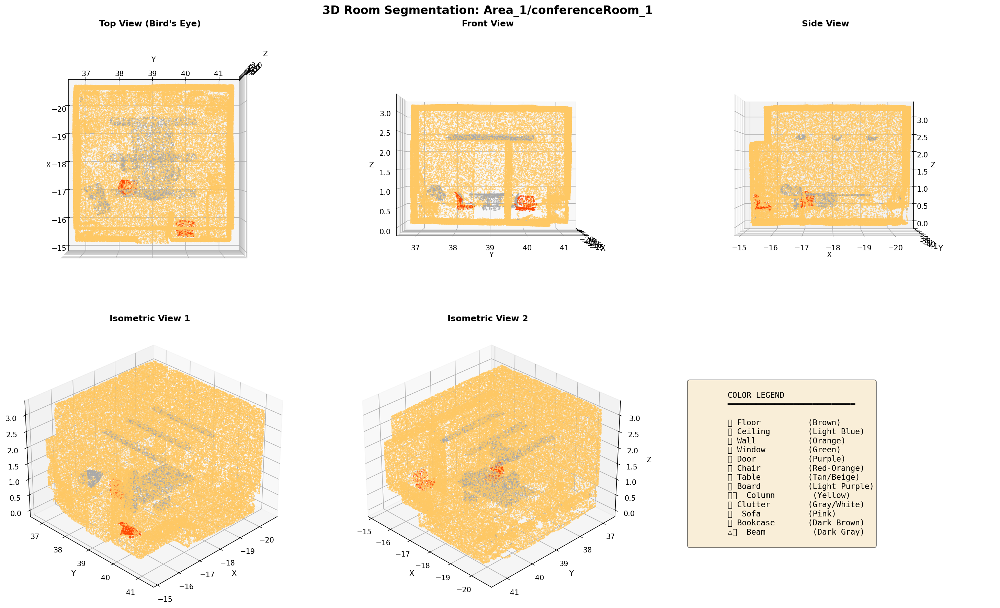

# 3D Room Scene Semantic Segmentation

## Overview

This project implements geometry-based and ML-enhanced pipelines for semantic segmentation of 3D indoor scenes using the S3DIS dataset. The goal is to segment rooms into meaningful components—**floor, ceiling, walls, furniture, and object classes like chairs/tables**—using clustering, geometric features, and a Random Forest classifier.

To test different rooms and visualize the results, download the dataset from **web/dataset/.txt** and upload each room to website. You can visualize the results on website.

- **Input:** 3D point cloud data (.txt from S3DIS; can be converted to .ply/.pcd)  
- **Output:** Segmented point clouds and visualizations (.ply, .png) for each room  



---

## Table of Contents

- [Features](#features)
- [Dataset Download](#dataset-download)
- [Installation](#installation)
- [Project Structure](#project-structure)
- [Usage](#usage)
- [Quick Start (Classical Pipeline)](#quick-start-classical-pipeline)
- [ML-Enhanced Pipeline](#ml-enhanced-pipeline)
- [Batch Processing](#batch-processing)
- [Manual Room Selection](#manual-room-selection)
- [Testing on a Single Room](#testing-on-a-single-room)
- [Output Files](#output-files)
- [Parameter Tuning](#parameter-tuning)
- [References](#references)

---

## Features

- Loads and preprocesses 3D indoor scenes from S3DIS  
- Removes noise and downsamples point clouds  
- Segments rooms using DBSCAN / Euclidean clustering  
- Rule-based semantic labeling: floor, ceiling, walls, furniture  
- ML-enhanced labeling: Random Forest classifier for objects (chairs, tables, doors, windows, etc.)  
- Visualizes results and exports .ply and .png files  
- Batch processing for all rooms in all areas  

---

## Dataset Download

**You must download the S3DIS dataset from Kaggle:**

- [S3DIS Dataset on Kaggle](https://www.kaggle.com/datasets/ratanjyoti/s3dis-point-cloud-segmentation)

After downloading, extract the dataset so it matches this structure:

```
Stanford3dDataset_v1.2_Aligned_Version/
├── Area_1/
│   ├── office_1/
│   │   └── Annotations/
│   │       ├── ceiling_1.txt
│   │       ├── floor_1.txt
│   │       ├── wall_1.txt
│   │       ├── table_1.txt
│   │       └── ...
│   ├── hallway_1/
│   └── conferenceRoom_1/
├── Area_2/
├── Area_3/
└── Area_4/
```

Each `.txt` file contains points in format: `X Y Z R G B`

---

## Installation

Install required Python libraries:

```bash
pip install numpy scipy scikit-learn matplotlib
```

If you use Plotly for interactive visualization:

```bash
pip install plotly
```

---

## Project Structure

```
3D-Room-Scene-Semantic-Segmentation/
├── .venv/
├── codes/
│ ├── pycache/
│ ├── output_Area_1_conferenceRoom_1/
│ ├── test_results/
│ ├── batch_process.py
│ ├── clustering_module.py
│ ├── labelling_module.py
│ ├── main_pipeline.py
│ ├── ml_segmentation_pipeline.py    (main python file to run)
│ ├── my_room.py
│ ├── preprocessing_module.py
│ ├── quick_script.py
│ ├── simple_test.py
│ ├── simple_train.py
│ └── visualization_module.py
├── web/
│ └── dataset/        (download sample dataset to test the model)
├── app.py            (website code)
├── .gitignore
├── LICENSE
├── README.md
└── requirements.txt


```
Run simple_train.py to train the model 
Run simple_test.py to test how the model is performing
---

## Usage

### Quick Start

Process a sample room (e.g., Area_1/office_1):

```bash
python quick_start_script.py
```

This will:
- Find your dataset
- Process one room
- Generate segmented output and visualizations

### Batch Processing

To process **all areas and rooms** automatically, run:

```bash
python batch_process.py
```

All outputs will be stored in the `output/` directory, organized by area and room.

### Manual Room Selection

To process a specific room interactively, use:

```python
from main_pipeline import RoomSegmentationPipeline

AREA = input("Enter area (e.g., Area_1): ")
ROOM = input("Enter room (e.g., office_1): ")

pipeline = RoomSegmentationPipeline(output_dir=f"output_{AREA}_{ROOM}")

pipeline.run_complete_pipeline(
    anno_path=f"/path/to/Stanford3dDataset_v1.2_Aligned_Version/{AREA}/{ROOM}/Annotations",
    room_name=f"{AREA}_{ROOM}",
    voxel_size=0.02,
    eps=0.05,
    show_plots=True
)
```

---

## Output Files

All results are stored in the `output/` directory:

```
output/
├── Area_1_office_1/
│   ├── Area_1_office_1_segmented.ply
│   ├── Area_1_office_1_segmented.png
│   ├── Area_1_office_1_comparison.png
│   └── Area_1_office_1_topdown.png
├── Area_2_conferenceRoom_1/
│   └── ...
└── ...
```

- **.ply**: Segmented point cloud (view in MeshLab, CloudCompare, or [3dviewer.net](https://3dviewer.net/))
- **.png**: Visualization images

---

## Parameter Tuning

You can adjust parameters in the scripts for best results:

- `voxel_size`: Downsampling resolution (smaller = more detail)
- `eps`: Clustering separation (smaller = more clusters)
- `min_samples`: Minimum cluster size
- `floor_height_ratio`, `ceiling_height_ratio`: For labeling rules

---

## References

- [S3DIS Dataset](http://buildingparser.stanford.edu/dataset.html)
- [Kaggle S3DIS](https://www.kaggle.com/datasets/shengshi1/s3dis0)
- [DBSCAN Clustering](https://en.wikipedia.org/wiki/DBSCAN)
- [MeshLab](https://www.meshlab.net/)
- [CloudCompare](https://www.danielgm.net/cc/)
- [3dviewer.net](https://3dviewer.net/)

---

## License

This project is released under the MIT License.

---

## Contact

For questions or contributions, open an issue or pull request on GitHub.

---

**Happy segmenting! 🎯**
